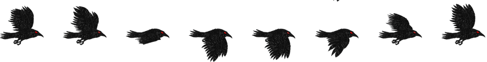

# Project 4a
[Deployed to surge](http://eru-project4a.surge.sh/)

# Demo:

# Sprites used: 
[Original Spritesheet ](https://www.pngfind.com/mpng/iTxJwo_sonic-3-sprite-png-sonic-3-sprites-png/)

  

# Got the above spritesheet from google images, then image traced it and expanded it with Adobe Illustrator. Also upscaled it to get these:

# Implementation details:

The original animation which this is based on is the [Alice & red queen example.](https://codepen.io/rachelnabors/pen/PNGGaV). An easier way would be to use pre-animated gifs
instead of spritesheets and then translate them around. I decided to use a spritesheet because I didnt really know how it would work so I got to learn something. The idea is to
keep the entire sprite animation inside a container that is fixed to be the size of a single animation frame. Then we set **overflow: 'hidden'** on this container and apply an animation
to the inner image to continuously keep translating it Indefinitely.

Here I am using 2 animation hooks directly from [use-web-animations](https://github.com/wellyshen/use-web-animations). One is applied to the image to make it scroll and seem animated. The
other is applied to its container to be able to translate it across the screen. I also added 3 different sprites based on the speed of the container. This was a bit challenging
since the sprites are not all of the same length, some have 15 images, that require an easing of steps(15,end) while others have steps(9,end). I wasn't able to find a way to
directly modify an existing animation's timing. I was able to get the animations by using getAnimation() but there is no setTiming() implemented yet. So what I did was take advantage
of the already implemented animate() function which basically adds another animation on top of whatever is already present. So whenever I want to change the sprite, I am using local state
to keep track of the image that is currently being used, I change the state, cancel the current animation by animationObject.getAnimation().cancel() and then I add the same animation
back by using animate() but this time I include a changed easing function with the correct steps. Maybe another option would be to keep the #steps as state and whenver i change the image
I just change that number, But i dont know how the hook works with state updates so I havent experimented with that yet.

Sonic also slows down over time and during the slowdown the sprite animation also changes accordingly.
